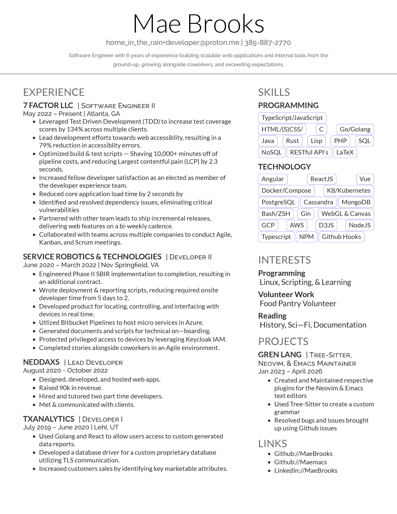

* Hello! This is my latex setup for my resume!

** Requirements:

- `tlmgr`
- `xelatex`

** Building:

#+BEGIN_SRC bash
cc nob.c -o nob
#+END_SRC

**Re-running `nob` will cause it to rebuild on changes**
```sh
./nob
```

* My Resume

[[./Mae Brooks Resume.pdf][My Resume]]



* Special Thanks

- to [[https://github.com/tsoding/nob.h][Tsoding's Nob.h]]
- to [[http://debarghyadas.com][Debarghya Das]], [[https://github.com/ZDTaylor/Deedy-Resume-Reversed][Zachary Taylor]] as the original authors of this latex template used for resume.tex

